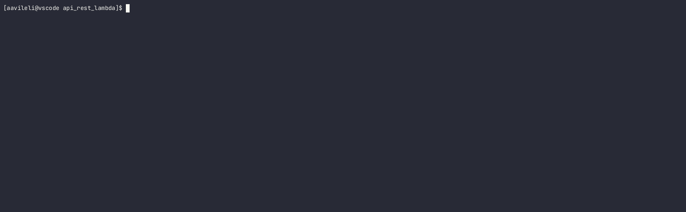
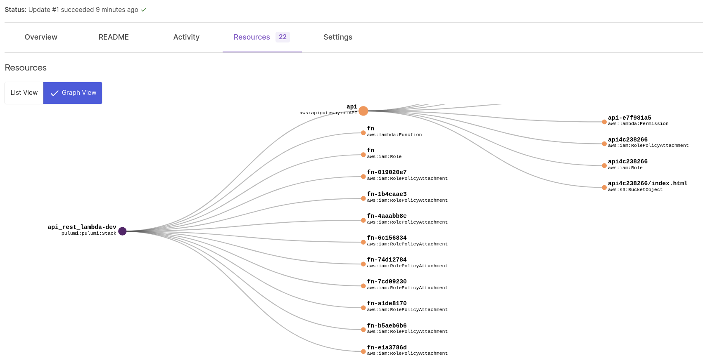
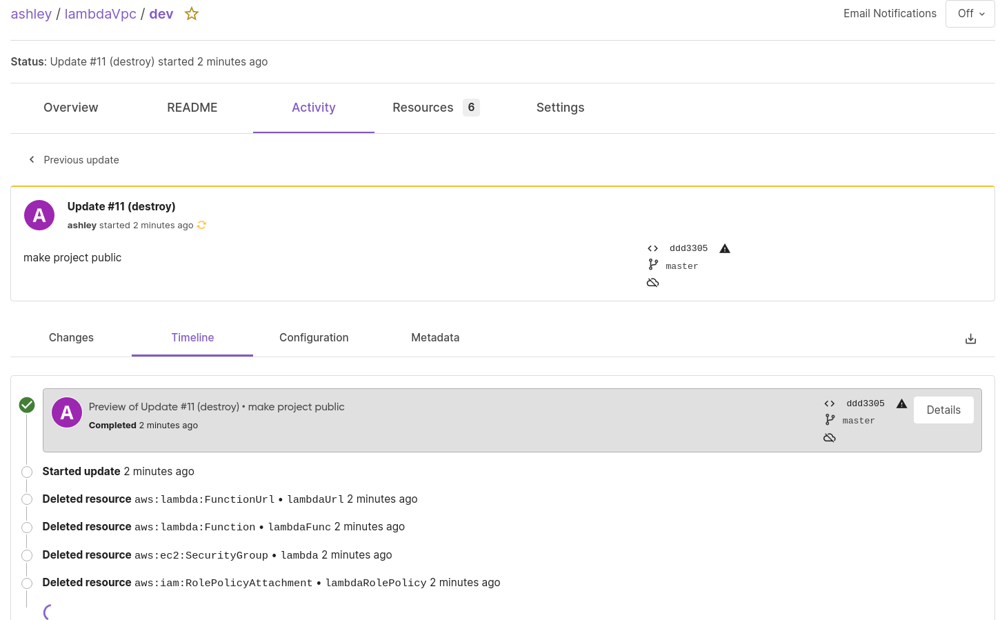

# Pulumi POC 


## Installing Pulumi 

```
curl -fsSL https://get.pulumi.com | sh
```

## Creating a project (aws Typescript)

- create the project directory, cd into it and run the following command.
```
pulumi new aws-typescript
```
If you want to see all the templates available execute command `pulumi new`


## Understanding the Project layout

**Our project is comprised of multiple files:**

`package.json` and `package-lock.json`
 
 your project’s NPM dependency information

 `tsconfig.json`
 
  your project’s TypeScript settings

`node_modules/`

A directory containing your project’s installed NPM dependencies

```
Pulumi.yaml
```

The Pulumi.yaml project file specifies metadata about the Pulumi project. There can only be one project file per Pulumi project.

A Pulumi.yaml file might look something like the following:

```
name: lambda-test
description: testing lambda function on aws
runtime: nodejs
backend:
  url: file://
```
Pulumi state files are stored in your project application folder, inside the .pulumi folder. While in some cases, storing them locally may work for you, in others, you may want to store these in a controlled, centralized, remote storage.

This is where the concept of Pulumi backends  comes into play, which represent different storage services, that you can use for storing your state files.

For example, you can create a simple S3 bucket, and choose to store your files in it. You can also use the Pulumi Service, which, in addition to storing state files, also provides a couple of other cool features.

Read more about different backends in the following [official documentation article](https://www.pulumi.com/docs/intro/concepts/state/).
```
Pulumi.stack-name.yaml
```
The `Pulumi.{stack-name}.yaml` file is a [Pulumi stack settings](https://www.pulumi.com/docs/intro/concepts/state/)  file. There can be more than one stack settings files, for example, for a couple of different environments. For example, it’s possible to have Pulumi.dev.yaml, Pulumi.staging.yaml, Pulumi.production.yaml, and so on.

```
index.ts
```
This is the entry point file in which you start to define your infrastructure (the Pulumi program). You can organize the code in any way you like. Remove the sample template generated code by the bootstraping command.

## pulumi command reference

- `pulumi up`
Will preview the changes pulumi is going to apply, its like terraform plan. The command will output changes it will apply. You can apply, deny or get more details.
>

- `pulumi stack ls`
This command will list all stacks created and show you the current stack. They are basically environemnts like dev, stagging and production. They all have seperate stack config files but single program.

- `pulumi stack init staging --copy-config-from dev`
This will copy the stack config from dev 

- `pulumi config set aws:profile default -s dev`
This command will update dev stack with the aws profile to use. You will see this information in the `pulumi.dev.yaml` config file.
You can also set secrets which will be encrypted per stack with the `--secret` flag. 

Please note you can use aws kms secret key to encrypt values. You need to create the stack with the following cmd
`pulumi stack init --secrets-provider="awskms://alias/ExampleAlias?region=ap-southeast-2"`


- `pulumi stack output -s dev`
This command will show stack outputs for the `dev` stack

# Three projects demostrating the usage of pulumi to deploy aws infrastruture.

Prerequisite:
  - run `pulumi login` and create an account. 
    I like the cloud team model as it allows to track what is happening, when things were deployed and direct aws links, resource graphs of infrastructure deployed.
    > 
    >
     

  - use a node docker container and install the dependency once you clone the repo using `npm install` example docker 
    ```
    docker run -it \
    -e PULUMI_ACCESS_TOKEN \   # I am using the free pulumi cloud service in this examples if the backend is s3 this is not required
    -e AWS_ACCESS_KEY_ID \
    -e AWS_SECRET_ACCESS_KEY \
    -e AWS_REGION \
    -w /app \
    -v $(pwd):/app \
    --entrypoint bash \
    pulumi/pulumi \
    -c "npm install && pulumi preview --stack dev --non-interactive"
    ```

## [::Api Rest Lambda::](./api_rest_lambda/index.ts)
  High level infrastructure that creates a rest api gateway with 2 routes serving a page from s3 and a rest call to a lambda function to display the time in that s3 page. I have also shown how to overide the iam role to include the security boundary policy we use internally in our organization. Please note some of the policy roles it creates are quite broad, the higher level module allows role injection to supply your own role.

  >Re-run the secret encryption config cmd as the `secOpsPolicy` stack variable is encrypted using my cloud credentials 
  ```bash
    pulumi stack select dev
    pulumi config set secOpsPolicy <security boundary arn> --secret
  ```
  
  > If you want to delete the stack after applying the stack in our account you will get an error on deleting api s3 bucket. Our sre policies dont allow s3 bucket deletion so you have to manually remove the bucket.
    

## [::Terragrunt VPC::](./bgl_terragrunt_vpc/index.ts)
  This project shows how to consume terraform state generated by terragrunt. Building re-useable [ComponentResource](./bgl_terragrunt_vpc/tg_vpc_output.ts). This module can be published to private npm package to be consumed by other projects.
  >Re-run the secret encryption config cmd as the `state_bucket` stack variable is encrypted using my cloud credentials 
  ```bash
  pulumi stack select dev|prod|sgprod # do this for each individula stack 
  pulumi config set state_bucket <s3 bucket value> --secret
  ```

## [::Lambda URL VPC::](./lambdaVpc/index.ts)
  This project demostrates consuming resources generated in other stacks, composing resources like terraform and building re-useable modules/function [factory functions](./lambdaVpc/lib.ts) to create service identity roles. This project creates a rest lambda function without api-gateway
  >Re-run the secret encryption config cmd as the `secOpsPolicy` stack variable is encrypted using my cloud credentials 
  ```bash
    pulumi stack select dev
    pulumi config set secOpsPolicy <security boundary arn> --secret
  ```


###  _References::_
1. [Architecture & Concepts](https://www.pulumi.com/docs/intro/concepts/)
2. [Organizing Projects and Stacks](https://www.pulumi.com/docs/guides/organizing-projects-stacks/)
3. [how to guides](https://www.pulumi.com/registry/packages/aws/how-to-guides/)
4. [Pulumi Learn](https://www.pulumi.com/learn/)
5. [Refactoring Infrastructure as Code](https://www.pulumi.com/blog/refactoring-iac/?utm_source=twitter&utm_medium=social&utm_campaign=blog&s=09)